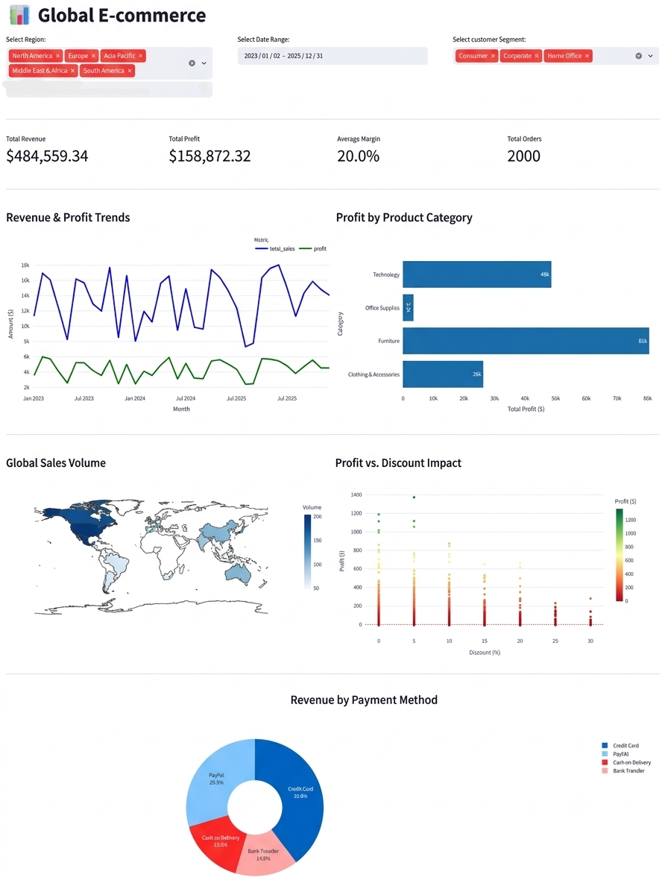

# 🛒 Retail & E-Commerce Sales Analytics Dashboard

## 📌 Project Overview
This project features an interactive analytics dashboard developed to monitor core retail and e-commerce performance metrics in real-time. Raw sales datasets were queried and cleaned using SQL, then processed with Python (Pandas & NumPy) to ensure accuracy. The final application was built using Streamlit and Plotly to engineer dynamic visual reports analyzing sales volume, revenue trends, and fluctuating profit margins.

## 🛠️ Tools & Technologies
*   **Data Processing & Cleaning:** Python (Pandas, NumPy), SQL (PostgreSQL)
*   **Web Framework & Visualization:** Streamlit, Plotly
*   **Techniques:** Real-time metric tracking, dynamic interactive charting, data aggregation, and SQL window functions.

## 📸 Dashboard Preview

## 🎥 Dashboard Demonstration
[👉 Click here to watch the interactive Dashboard Video Demonstration](e-commerce.dashboard.mp4)

## 📊 Key Insights & Features
*   **Revenue Tracking:** Real-time monitoring of overall sales volume and profit margins.
*   **Dynamic Visualizations:** Interactive Plotly charts allowing users to explore historical data trends.
*   **Data Filtering:** Streamlit interface elements enabling quick drill-downs into specific product categories or timeframes.
*   **Robust Data Pipeline:** SQL-backed data extraction and Python-based structuring for optimal application performance.

## 📁 Repository Files
*   `dashboard-python-code.py`: The main Python script containing the Streamlit application and Plotly visualization code.
*   `complete-sql-cleaning-syntax...`: The SQL scripts and syntax used for initial data extraction, filtering, and aggregation.
*   `e-commerce.dashboard.mp4`: Video demonstration of the Python dashboard's interactive features.
